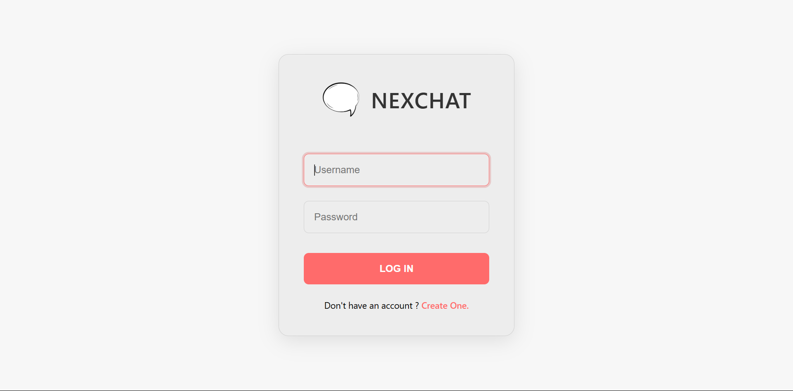
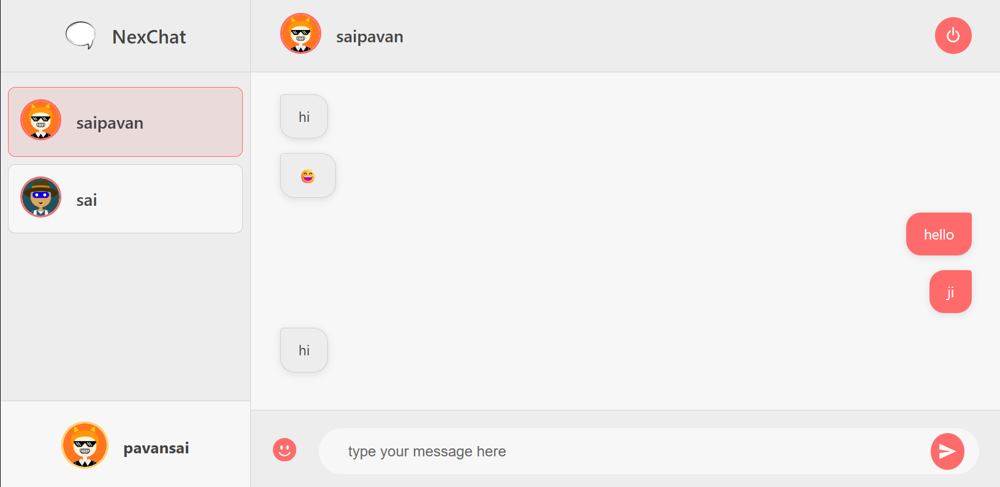

# NexChat Application 
NexChat is chat application build with the power of MERN Stack.





## Installation Guide

### Requirements
- [Nodejs](https://nodejs.org/en/download)
- [Mongodb](https://www.mongodb.com/docs/manual/administration/install-community/)

Both should be installed and make sure mongodb is running.
### Installation

#### First Method
```shell
git clone https://github.com/Pavansai1967/chat-app
cd chat-app
```
Create env .files in public and server


Now install the dependencies
```shell
cd server
yarn
cd ..
cd public
yarn
```


For Frontend.
```shell
cd public
yarn start
```
For Backend.

Open another terminal in folder, Also make sure mongodb is running in background.
```shell
cd server
yarn start
```

now open localhost:3000 in your browser.